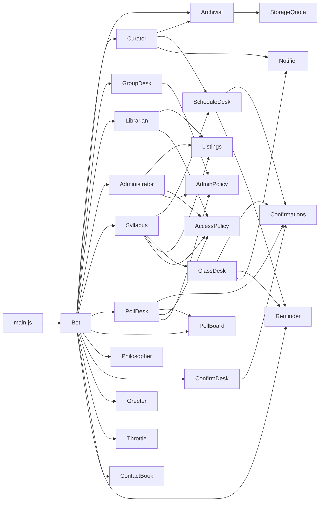
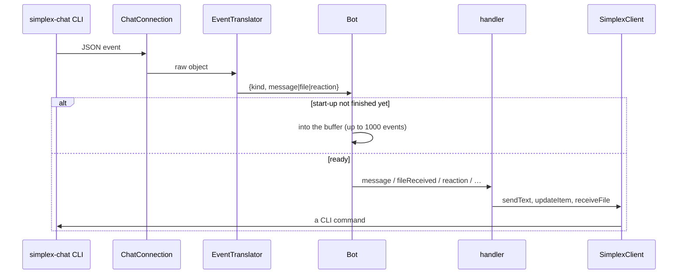
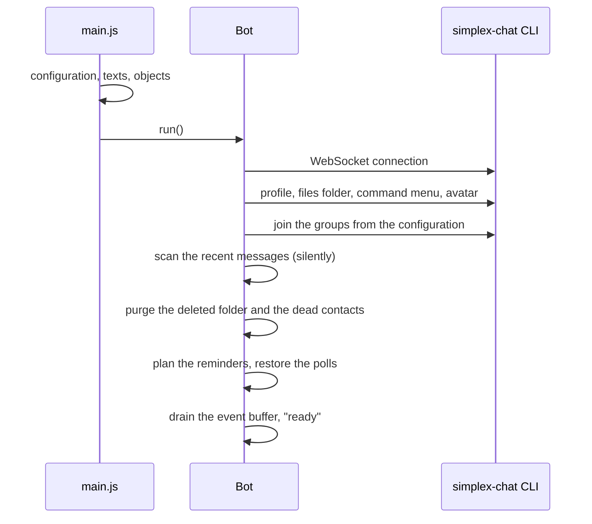

# Architecture

What this is: a SimpleX Chat bot ("spinoza"/spinoza). It keeps the group's files, runs the classes
and the schedule, holds polls and answers questions about Spinoza's Ethics.

Node >= 22, ESM, **zero npm dependencies**. The bot is a client of the official `simplex-chat` CLI:
the CLI holds the database, the keys and the network, the bot talks to it over a WebSocket (`-p 5225`).
In production both processes live in one Docker container.

Neighbouring documents: [INTERFACE.md](INTERFACE.md) - every command and the answer it really
produces; [FEATURES.md](FEATURES.md) - the features and their diagrams; [README.md](README.md) - how
to run and configure it.

## Layers

```mermaid
flowchart TB
    subgraph cli["simplex-chat CLI (external process)"]
        ws["WebSocket :5225"]
    end
    subgraph transport["src/transport - the protocol"]
        conn["ChatConnection<br/>frames, timeouts, reconnect"]
        client["SimplexClient<br/>CLI commands"]
        tr["EventTranslator<br/>CLI JSON → domain"]
    end
    subgraph bot["src/bot - behaviour"]
        orch["Bot - event routing"]
        group["group: Archivist, Curator,<br/>GroupDesk, PollBoard, Reminder"]
        priv["private: Librarian, Administrator,<br/>Syllabus, PollDesk, Philosopher,<br/>ConfirmDesk, Greeter, Throttle"]
    end
    subgraph domain["src/domain - rules without input or output"]
        rules["Command, Message, Session,<br/>ClassSchedule, ClassCalendar, Poll"]
    end
    subgraph storage["src/storage - folders and JSON"]
        st["FolderFileStore, SessionStore,<br/>PollStore, SubscriberStore, AdminRegistry"]
    end
    subgraph i18n["src/i18n - every text"]
        texts["ru.js / en.js / uk.js / it.js<br/>(identical keys), layout.js"]
    end
    ws <--> conn --> client --> orch
    conn --> tr --> orch
    orch --> group & priv
    group & priv --> domain
    group & priv --> storage
    group & priv --> i18n
```



Layer rules (they must not break, tests stand on them):

1. **Behaviour classes know neither sockets nor CLI JSON.** They get a gateway (`SimplexClient`)
   and texts (`replies`) injected. In tests the gateway is `FakeGateway` from `test/unit/helpers.js`.
2. **Only `src/transport` knows CLI field names.** When the protocol changes, one file is edited.
3. **`src/domain` is pure data and rules.** No files, no sockets, no clock: the time arrives as an
   argument (`now`), so tests never wait.
4. **Every string a person sees lives in `src/i18n`.** Every language has the same set of keys,
   parity checked by a test.
5. **`src/main.js` is the only place where objects are created** (the composition root); nobody else
   reads argv, env or the config file.

## Module map

### Entry point and settings

| file | what it does |
| --- | --- |
| [src/main.js](src/main.js) | The composition root: reads the configuration, builds the whole object graph, catches SIGINT/SIGTERM. No logic - assembly only. |
| [src/config.js](src/config.js) | Settings in layers: defaults → JSON file → environment variables → flags. The result is frozen. The `--help` text lives here too. |

### Transport (`src/transport`)

| file | what it does |
| --- | --- |
| [ChatConnection.js](src/transport/ChatConnection.js) | The WebSocket to the CLI: request/response correlation, timeouts, event delivery, automatic reconnect. Knows nothing about chat semantics. |
| [SimplexClient.js](src/transport/SimplexClient.js) | The gateway: sending messages and edits, receiving files, working with groups, contacts, reactions and the command menu. The only object the bot classes see as "the network". |
| [EventTranslator.js](src/transport/EventTranslator.js) | Turns raw CLI JSON into domain events (`message`, `messageUpdated`, `messageDeleted`, `fileReceived`, `reaction`, …) and into a `Message`. The only place with CLI field names. |

The commands follow the official bot API ([bots/api/COMMANDS.md](https://github.com/simplex-chat/simplex-chat/blob/stable/bots/api/COMMANDS.md)):
`/_address`, `/_address_settings`, `/_connect`, `/_send`, `/_update item`, … with the user id where the API asks for it.
A few commands the bot needs are outside that reference and may change with a CLI update - run the e2e
suite after every `scripts/update-cli.sh`: `/_get chat` (history scan, a quoted file), `/_reaction members`
(poll ballots after a restart), `/_create member contact` + `/_invite member contact` (`/spinoza` without a
contact), `/files_folder`, `/set profile image`, `/set bot commands`. At start-up the bot turns on
`/_set accept member contacts` - without it a direct chat a member opens from the group waits for a manual accept forever.

### Domain (`src/domain`) - pure rules

| file | what it does |
| --- | --- |
| [Command.js](src/domain/Command.js) | Command parsing: aliases (Russian, English, one-letter), the `/файлы` (files) and `/занятие` (class) sections (`resolveSection`), hints on a typo (`suggestCommand`), group forms (`parseGroupCommand`). |
| [Message.js](src/domain/Message.js) | The normalised incoming message - the only shape the logic sees. The flags `isGroup`, `isDirect`, `hasFile`, `isReplayed`; the file name check. |
| [Session.js](src/domain/Session.js) | A class as data: date, topic, posts, files, recording; date parsing (`сегодня` today, `в пятницу` on Friday, `19.09`), class announcements, choosing the class a file belongs to. |
| [ClassSchedule.js](src/domain/ClassSchedule.js) | The regular schedule: weekday plus time in a time zone. Computes the next and the previous class through `Intl`, without libraries. |
| [ClassCalendar.js](src/domain/ClassCalendar.js) | The schedule plus its exceptions: moved and cancelled classes, the status of a class, the card, the overviews (upcoming, recent, month, year, archive). |
| [Poll.js](src/domain/Poll.js) | A poll: command parsing, creation, ballots from reactions, counting, statuses; the list of emoji options. |
| [StoredFile.js](src/domain/StoredFile.js) | An archived file as data: the name in the store, the size, the date. |
| [membership.js](src/domain/membership.js) | Which member statuses mean "no longer a member". |

### Behaviour (`src/bot`)

The group side:

| file | what it does |
| --- | --- |
| [Archivist.js](src/bot/Archivist.js) | Keeps every file posted in a watched group: orders the download within the quota into the flat archive, silently (refusals go to the log). Tells which file a trigger-word request refers to (`findRequested`) and where a file is (`locate`). |
| [Courier.js](src/bot/Courier.js) | The trigger word in the group: sends the requested file to the member's private chat - after its download, or after the member accepts a chat the bot opened. The group hears nothing. |
| [PrivateLine.js](src/bot/PrivateLine.js) | Reaching a member with no usable private chat: opens one through the group (or a one-time link), tells a pending chat from a dead one. Shared by GroupDesk and Courier. |
| [Curator.js](src/bot/Curator.js) | Classes in the group: marks a class post, follows edits of the homework, attaches files to a class, puts a recording with the last class (`prius`). |
| [GroupDesk.js](src/bot/GroupDesk.js) | `/spinoza` - the single entry point in the group: the personal help, opening a private chat, the one-time link, the greeting when the bot joins a group; any private command typed in the group gets one hint line (limited to 3 per 10 minutes). |
| [PollBoard.js](src/bot/PollBoard.js) | A poll in the group: one message that is edited as the reactions arrive (debounced by 2 s), closing on the deadline, rebuilding the ballots after a restart. |
| [Reminder.js](src/bot/Reminder.js) | "The class starts in N minutes" in the group, once per class; the plan is recomputed on every schedule change. |
| [TriggerWord.js](src/bot/TriggerWord.js) | The trigger word (`conatus`): whether a text uses it, and whether it IS the word (a request, not a sentence). |

The private chat:

| file | what it does |
| --- | --- |
| [Librarian.js](src/bot/Librarian.js) | Files: the list, sending a file by number or name, the section help, the general help `/?` and `/??`, hints for unknown commands. |
| [Administrator.js](src/bot/Administrator.js) | Upkeep and rights: deleting and restoring files, the deleted folder, `/место` (space), `/статус` (status), the admin commands, granting rights by the secret with a lockout after wrong attempts. |
| [Syllabus.js](src/bot/Syllabus.js) | The `/занятие` (class) section: the card, the lists, the schedule, a move, a cancellation, the help, the notification subscription. |
| [ScheduleDesk.js](src/bot/ScheduleDesk.js) | Showing and changing the regular schedule: the preview and applying it after `/подтвердить` (confirm). |
| [ClassDesk.js](src/bot/ClassDesk.js) | Moving and cancelling one class: the preview, handing the posts and file references to the new date, announcing it in the groups. |
| [PollDesk.js](src/bot/PollDesk.js) | Polls in the private chat: creation with a preview, the state, closing, cancelling, the history. |
| [Philosopher.js](src/bot/Philosopher.js) | The Ethics: an entry by its identifier, the modes, search, the list, a random entry; long answers are split into several messages. |
| [ConfirmDesk.js](src/bot/ConfirmDesk.js) | `/подтвердить` (confirm) and `/отменить` (drop) - one place for every pending action. |
| [Greeter.js](src/bot/Greeter.js) | Greets a new contact; first it waits up to ~8 s while SimpleX links the contact to its group member. |
| [Throttle.js](src/bot/Throttle.js) | The rate limit on private messages: one warning, then silence until the window ends. |

Shared:

| file | what it does |
| --- | --- |
| [Bot.js](src/bot/Bot.js) | The orchestrator: connecting, the start-up setup with retries, the event buffer until it is ready, routing events to the handlers. No chat logic of its own. |
| [Confirmations.js](src/bot/Confirmations.js) | Pending actions: one per person, alive for 10 minutes. Pure bookkeeping. |
| [Listings.js](src/bot/Listings.js) | Which numbered list the person saw last, so that `/дай 3` (get 3) means what they read. |
| [Notifier.js](src/bot/Notifier.js) | Notifies the subscribers about changes to a class, one message per class after a quiet period (120 s). |
| [AccessPolicy.js](src/bot/AccessPolicy.js) | Who may use the files and the classes: group members only, or everybody. |
| [AdminPolicy.js](src/bot/AdminPolicy.js) | Who is an administrator: those who know the secret plus the group's owners and admins. |
| [WatchedGroups.js](src/bot/WatchedGroups.js) | Which groups are served (a name pattern). |
| [StorageQuota.js](src/bot/StorageQuota.js) | The archive limit and the free space; reservations for downloads so that parallel files do not exceed the limit; a stuck reservation expires after 6 h. |
| [RateLimiter.js](src/bot/RateLimiter.js) | A sliding-window counter per key. |
| [ContactBook.js](src/bot/ContactBook.js) | Removes dead contacts, otherwise SimpleX will not link a member to a new contact. |
| [UnknownCommands.js](src/bot/UnknownCommands.js) | Counts the commands that were not understood, for `/статус` (status). |
| [replies.js](src/bot/replies.js) | Picks the language of the texts and substitutes the trigger word. |

### Stores (`src/storage`)

| file | what it keeps |
| --- | --- |
| [FolderFileStore.js](src/storage/FolderFileStore.js) | A flat folder of files (the archive or the deleted folder). The source of truth is the directory itself; names never leave the folder. `flatten()` lifts the class subfolders of older versions. |
| [Outbox.js](src/storage/Outbox.js) | Copies (hard links) of the files the bot sends: the CLI deletes the file of a deleted chat item, so it never gets an archived original. Released after the upload, purged by age. |
| [flattenArchive.js](src/storage/flattenArchive.js) | Start-up migration: lifts the files of the old per-class folders to the archive root and rewrites the cards' references (files lifted out of `deleted/<date>/` stay restorable to that class). |
| [SessionStore.js](src/storage/SessionStore.js) | `state/sessions.json`: the schedule and the classes by date; a class refers to its files by their archive names (`files`) and remembers the ones taken off the card (`deletedFiles`) for `/restore`. |
| [PollStore.js](src/storage/PollStore.js) | `state/polls.json`: the polls and the next number. |
| [SubscriberStore.js](src/storage/SubscriberStore.js) | `state/subscribers.json`: who is subscribed to class changes. |
| [AdminRegistry.js](src/storage/AdminRegistry.js) | `state/admins.json`: the contacts that proved they know the secret. |

### Texts, the Ethics, utilities

| file | what it does |
| --- | --- |
| [i18n/ru.js](src/i18n/ru.js), [i18n/en.js](src/i18n/en.js), [i18n/uk.js](src/i18n/uk.js), [i18n/it.js](src/i18n/it.js) | Every visible string, one file per language; the key sets match, a test checks it. |
| [i18n/layout.js](src/i18n/layout.js) | List layout: fitting the lines into the message size, shortening a long file name while keeping the extension. |
| [ethics/EthicaIndex.js](src/ethics/EthicaIndex.js) | The index of the Ethics: identifiers, output modes, search, hints for a wrong identifier. |
| [ethics/Citations.js](src/ethics/Citations.js) | Latin quotations for the help texts and the greetings, in a shuffled cycle without repeats. |
| [util/logger.js](src/util/logger.js) | A logger with levels and a function that hides secrets. |
| [util/redact.js](src/util/redact.js) | Hides the argument of `/admin` in every form in which it could reach the log. |
| [util/glob.js](src/util/glob.js) | The patterns `*` and `?` without regular expressions: a user's pattern cannot cause exponential backtracking. |
| [util/format.js](src/util/format.js) | Sizes: "100gb" → bytes and back. |

## Who depends on whom



The dependencies go one way: `Bot` knows the handlers, the handlers know the domain, the stores
and the texts. There are no back references, so any handler is built on its own in a test.

## How an event travels through the system



The order of the handlers for a message (`Bot.#routeMessage`):

- **group**: replayed history is skipped; otherwise `Curator` (it claims a class's files first), then
  `GroupDesk`; a file is handed to `Archivist` in any case.
- **private**: `Throttle` → `Administrator` → `ConfirmDesk` → `PollDesk` → `Syllabus` →
  `Philosopher` → `Librarian` (the last one answers everything else and the typos).

Every handler returns "mine/not mine", so the order is the priority.

## What is on disk

```text
data/files/                 the archive (flat; a class card refers to files by name)
data/deleted/               the deleted folder; purged after deletedRetentionDays
data/state/sessions.json    the schedule and the classes
data/state/polls.json       the polls
data/state/subscribers.json the subscriptions to class changes
data/state/admins.json      the administrators
data/state/address.txt      the bot's address (or invite.txt - the link for the first administrator)
data/db/                    the CLI's own database (keys, chats) - the bot does not touch it
data/tmp/                   the CLI's temp folder, must be on the same filesystem as files
```

The repository: `src/` the code, `test/unit` the tests (node:test), `test/e2e` the Docker scenario,
`scripts/` running and deployment, `docker/` the images and the test network, `deploy/` the
production compose, `data/` the index of the Ethics, the quotations, the avatar.

## How it starts



The start-up setup is retried every 5 seconds while the CLI is not ready yet; events that arrive
before it is ready pile up in the buffer and are handled afterwards.

## Where to add something new

- **A new command**: the word goes into `ALIASES`/the subcommands in `src/domain/Command.js`, the
  behaviour into a fitting class in `src/bot`, the text into every language file in `src/i18n`, a step
  into `test/e2e/runner.js`.
- **A new calendar rule**: a pure function in `src/domain/ClassCalendar.js` plus a unit test; the
  handlers only call it.
- **A new CLI protocol field**: `src/transport/EventTranslator.js` only.
- **A new setting**: `DEFAULTS` and `OPTIONS` in `src/config.js`, a line in `USAGE`, passing it on
  from `main.js`.

Both checks have to stay green: `npm test` (unit) and `npm run test:e2e` (Docker, the real CLI and
three counterparts). Every behaviour that is visible in a chat gets a step in the e2e scenario.
