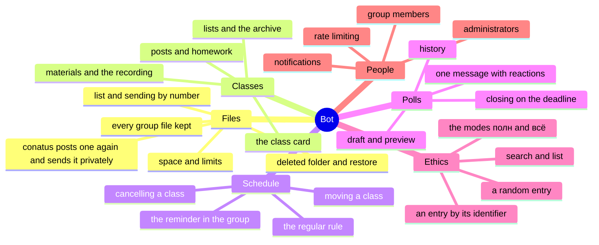
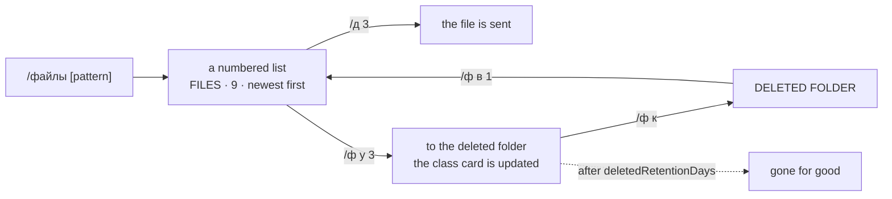
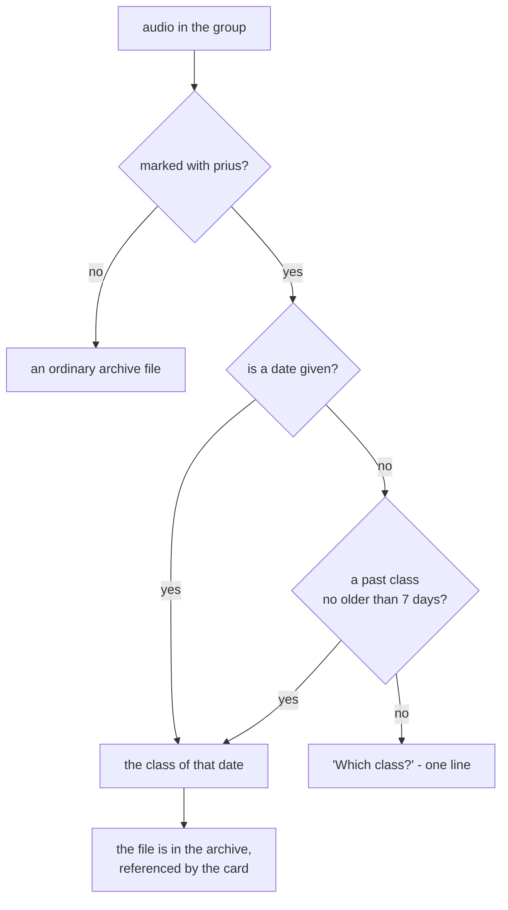
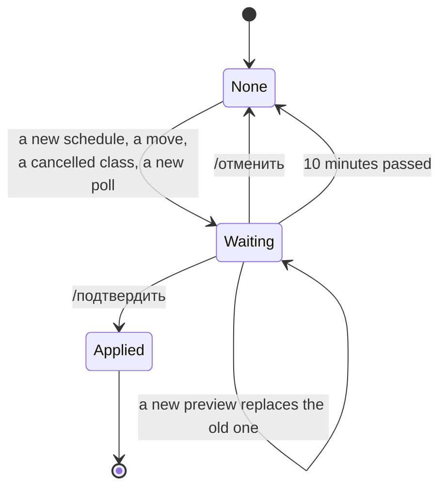
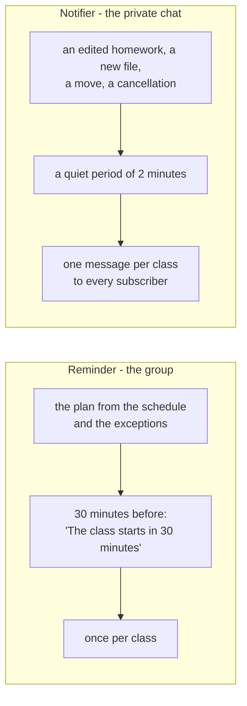
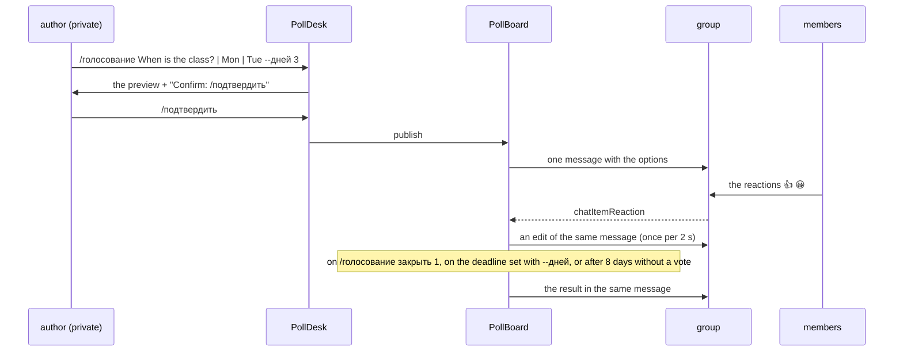
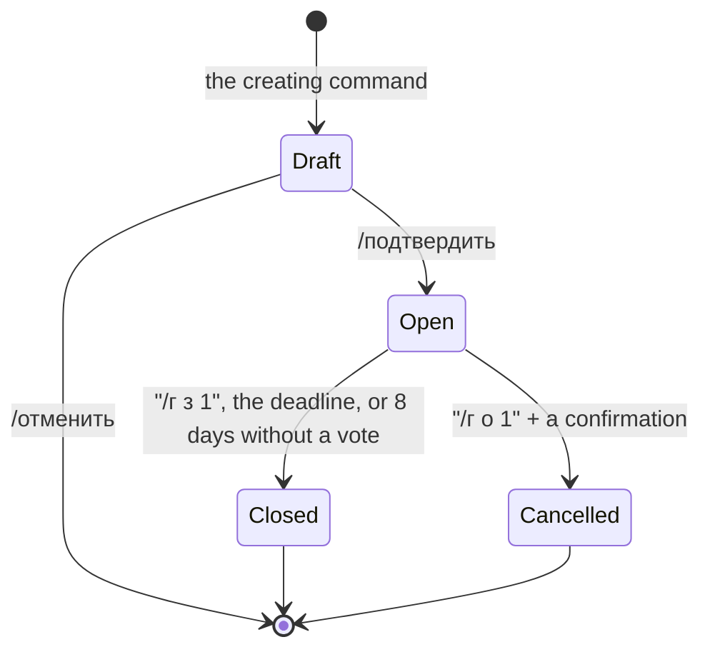
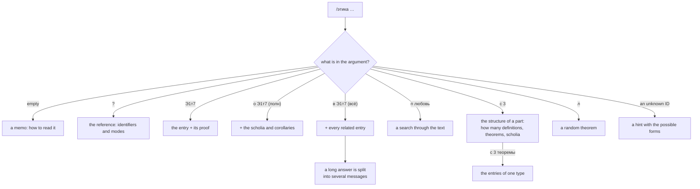
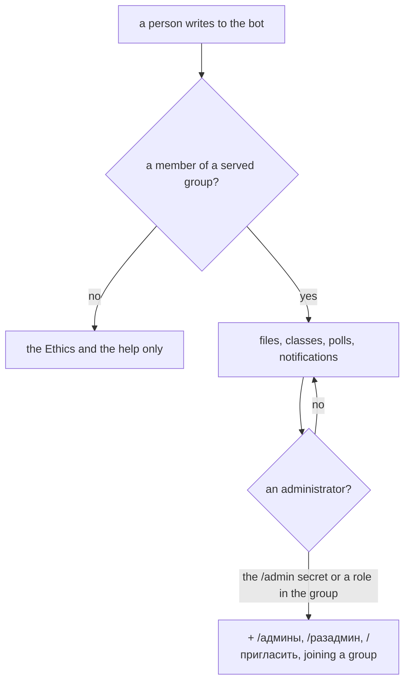
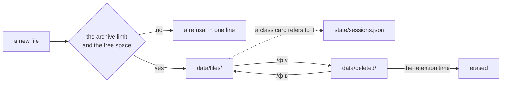

# What the bot does

What the bot can do, how each feature works and where it lives in the code. Real examples of the
answer to every command are in [INTERFACE.md](INTERFACE.md); the module map is in
[ARCHITECTURE.md](ARCHITECTURE.md).

Everywhere below "the trigger" is the word from the `trigger` setting (in the working group it is
`conatus`).

## Overview



## 1. Keeping files from the group

Every file posted in the group goes into the archive - silently - and stays there until its post is
deleted for everyone or a member deletes it with `/удалить`. The trigger word asks for a file
PRIVATELY: as a reply to the file, or as a separate message right after it (SimpleX comments reach
the CLI without a link to their parent, so the bare word refers to the last file above; a comment
naming a recent file refers to that file). The group hears nothing either way.

```mermaid
sequenceDiagram
    participant U as member
    participant G as group
    participant A as Archivist
    participant C as Courier
    participant P as private chat
    U->>G: a file
    G->>A: message with a file
    A->>G: receiveFile (within the quota; a refusal goes to the log)
    U->>G: "conatus" (a reply to the file, or right after it)
    G->>C: the request
    C->>A: findRequested, locate
    C->>G: the file again, as a reply: "alice, the file is also in your private chat with me."
    alt the member has a private chat
        C->>P: the file (once its download finished)
    else no private chat yet
        C->>P: open one: "You asked for name.pdf - it comes once you accept"
        P-->>C: contactConnected
        C->>P: the file
    end
```

Details:

- **The group stays a conversation.** Saving says nothing. The answer to `conatus` is the file posted
  again in the group as a reply to the request, captioned in one short line that the member has it
  privately too - and the file in the private chat. The same file is re-posted in a group at most once
  in 10 minutes (the copy is right above); the private copy goes every time. "Which file?" and "no
  longer kept" come privately only, with nothing in the group. When the group forbids direct
  messages, a one-time link to a private chat is posted under the file (there is no other way to
  reach the member).
- **The history the bot re-reads is handled silently.** At start-up it looks again through the last
  `--scan` messages (100 by default) and through the history the group replays when it joins: the
  files missed while the bot was down are saved, old requests are not answered.
- **The word inside a sentence is not a request.** "Spinoza wrote about conatus…" sends nothing: a
  request is the bare word `conatus` (as a reply to a file or right after it) or a comment that names
  a recent file. The same holds for commands: in the group a command starts with a slash, a sentence
  like "The class is being moved…" is talk.
- **A post deleted for everyone** takes its file to the deleted folder.
- Requests wait in memory: a file still downloading is posted and sent when it arrives, a file for a member who
  has not accepted the private chat yet is sent on acceptance; after a restart the member asks again.
- A name with a path or with control characters is refused (in the log); an empty file is flagged in the lists.

Code: [Archivist.js](src/bot/Archivist.js), [Courier.js](src/bot/Courier.js),
[PrivateLine.js](src/bot/PrivateLine.js), [TriggerWord.js](src/bot/TriggerWord.js),
[StorageQuota.js](src/bot/StorageQuota.js), [FolderFileStore.js](src/storage/FolderFileStore.js).

## 2. Files in the private chat

The `/файлы` (files) section, short `/ф`: `список` (list), `дай` (get), `удалить` (delete),
`корзина` (deleted folder), `восстановить` (restore), `место` (space), `?`. The old commands
`/список`, `/дай`, `/удалить`, `/корзина`, `/восстановить`, `/место` work as synonyms.



A number always means what the person saw last: `Listings` remembers the last list shown in each
chat. An empty filter result does not disturb the numbering. After `/удалить` (delete) the bot
remembers the fresh deleted folder itself and writes "Bring back: /restore 1" - a real number, the
file just deleted is the first one in the deleted folder. If the file belonged to a class, the answer
names it too: "Removed from the class of 19.09.2026".

Code: [Librarian.js](src/bot/Librarian.js), [Administrator.js](src/bot/Administrator.js),
[Listings.js](src/bot/Listings.js).

## 3. Classes

A class is one date: the topic, the homework in posts, the materials and the recording. In the group
a class is marked with `/spinoza занятие [date] [topic]` on the first line of a post, in a reply to a
post or in a comment; in the private chat everything is shown by the `/занятие` (class) section,
short `/з`.

```mermaid
sequenceDiagram
    participant U as member
    participant G as group
    participant C as Curator
    participant S as SessionStore
    participant N as Notifier
    U->>G: post "/spinoza занятие 26.09 Holbach, chapter 6"
    G->>C: message
    C->>S: the class of 26.09: topic, post
    C->>G: "The post is tied to the class of 26 September, 19:00."
    U->>G: a file in reply to the post
    C->>S: the file is saved; the card gets a reference to it
    C->>N: the class changed
    N-->>U: one message to the subscribers after 2 minutes
    U->>G: the post is edited
    C->>S: the homework is updated
```

The card `/занятие [date]` shows only what is filled in: the status, the topic, the homework, the
numbered materials and the recording. The numbers of the card work right away: `/д 1` sends the first
file of the class. The lists are `/занятие список` (three upcoming and three recent), `09.2026` for a
month, `2026` for a year, `архив` for every year.

Code: [Curator.js](src/bot/Curator.js), [Syllabus.js](src/bot/Syllabus.js),
[Session.js](src/domain/Session.js), [ClassCalendar.js](src/domain/ClassCalendar.js).

## 4. The recording of a class

An audio file on its own is an ordinary file. It becomes the recording of a past class only when it
is marked with the word `prius` (in the caption, in a reply or in a comment). With no date the
recording goes to the last class if it was no more than seven days ago; `prius 05.09` names the class
explicitly.



Code: [Curator.js](src/bot/Curator.js), `resolveClassDate` in [Session.js](src/domain/Session.js).

## 5. Schedule, move, cancellation - and one confirmation

Every change of the calendar is shown first and applied only after `/подтвердить` (confirm, short
`/п`); `/отменить` (drop, `/о`) throws the preview away. One pending action per person, alive for
10 minutes.



What happens on a confirmation:

| action | what changes |
| --- | --- |
| a new schedule | the rule in `sessions.json`, the plan of the reminders; past classes are left alone, and future classes with materials keep their own time and stay where they are ("Stays as it is: 19.09.2026, 12:15") |
| a move | the posts and file references go to the new date (the files stay in the archive), a marker stays on the old date, an announcement goes into the groups |
| a cancellation | the materials go to the next class, an announcement goes into the groups |
| a poll | one message is posted in the group |

Calendar changes are open to any member and only in the private chat; the group shows the short form
of the schedule only. The private answer after `/подтвердить` names the place of the announcement:
Announced in the group "Ethics".

Code: [Confirmations.js](src/bot/Confirmations.js), [ConfirmDesk.js](src/bot/ConfirmDesk.js),
[ScheduleDesk.js](src/bot/ScheduleDesk.js), [ClassDesk.js](src/bot/ClassDesk.js).

## 6. The reminder and the notifications

Two different things: the reminder goes into the group, the notifications go to the subscribers
privately.



The subscription is `/уведомления вкл|выкл` (notifications on|off, short `/у вкл`), explicit, with no
toggle. The plan of the reminders is recomputed on every change of the schedule or of a class.

Code: [Reminder.js](src/bot/Reminder.js), [Notifier.js](src/bot/Notifier.js),
[SubscriberStore.js](src/storage/SubscriberStore.js).

## 7. Polls

A poll is created in the private chat, lives in the group as one message, and is voted on with
reactions - one emoji per option.



The states of a poll:



A poll has no deadline by default: it stays open while people vote and closes by itself after 8 days
without a vote (a vote or a withdrawn vote starts the count again); its author or an admin can close it
any time. `--дней N` (`--days N`) sets a deadline instead; the bot then closes the poll on that date.

After a restart the ballots are rebuilt from the reactions the CLI remembers, so the count is not
lost. A poll creates no new messages in the group - it only edits its own.

Code: [PollDesk.js](src/bot/PollDesk.js), [PollBoard.js](src/bot/PollBoard.js),
[Poll.js](src/domain/Poll.js), [PollStore.js](src/storage/PollStore.js).

## 8. Spinoza's Ethics

`/этика` (ethics, short `/э`) answers from the index of the Russian translation: identifiers of the
form `Э1т7`, natural requests ("часть 1 теорема 7" - part 1 theorem 7), search, the list, a random
entry.



Every answer starts by spelling out the identifier: `[Э1т7] Часть I · Теорема 7`. Latin quotations
from the Ethics open the help texts and the greetings - in a shuffled cycle, without repeats.

Code: [Philosopher.js](src/bot/Philosopher.js), [EthicaIndex.js](src/ethics/EthicaIndex.js),
[Citations.js](src/ethics/Citations.js).

## 9. Help and hints

The help is written with a question mark everywhere:

| form | what it shows |
| --- | --- |
| `/?` | the main commands - one line per section |
| `/??` | every command by section plus the blocks СОКРАЩЕНИЯ (abbreviations) and СПРАВКА (help) |
| `/ф ?`, `/з ?`, `/г ?`, `/э ?` | the help of a section |
| `/spinoza` in the group | the personal help arrives privately, the group gets one line |

The words `help`, `помощь`, `справка` are still understood, but are shown nowhere. Every section and
every frequent action is typed with its first Russian letter: `/ф`, `/з`, `/г`, `/э`, `/у`, `/с`,
`/д`, `/п`, `/о`; inside a section it is the first letter of the operation (`/з п 20:00`, `/ф у 2`,
`/г з 1`).

An unknown command is not executed: the bot names it, offers the closest one and counts it for
`/статус` (status). The one-letter forms and `?` take no part in the hints, and the admin commands
are never suggested.

Code: [Command.js](src/domain/Command.js), [Librarian.js](src/bot/Librarian.js),
[i18n/ru.js](src/i18n/ru.js), [UnknownCommands.js](src/bot/UnknownCommands.js).

## 10. People: access, joining a group, contacts



Joining a group: only an administrator adds the bot. In the group the single entry point is
`/spinoza`: a member who has a private chat gets the help privately, for a member without one the bot
opens a private chat through the group, and if the group forbids direct messages it posts a one-time
link (the same link for an hour).

A private command typed in the group (`/список`, `/этика Э1т7`, `/?`) gets one line, "This is done in
the private chat" - no more than three times per ten minutes per member; words without a slash the
bot does not touch in the group.

If a person deleted their chat with the bot, the dead contact stops SimpleX from linking the member
to a new chat - `ContactBook` deletes such contacts: on the deletion event, at start-up and on a
failed send.

Private messages are rate limited: the bot tells whoever went over the limit to slow down once and
then stays silent until the window ends. The administrator's secret never reaches the logs; after
five wrong attempts in an hour a lockout begins.

Code: [AccessPolicy.js](src/bot/AccessPolicy.js), [AdminPolicy.js](src/bot/AdminPolicy.js),
[GroupDesk.js](src/bot/GroupDesk.js), [ContactBook.js](src/bot/ContactBook.js),
[Throttle.js](src/bot/Throttle.js), [Greeter.js](src/bot/Greeter.js).

## 11. Storage



`/место` (space) shows what is used and what is free, the deleted folder and the retention time;
`/статус` (status) shows the version, the uptime, the groups, the archive, the number of classes and
the most frequent commands that were not understood. There are no technical zeros in the reports: an
empty deleted folder is called exactly that.

A file is never erased by a command: `/удалить` (delete) only moves it to the deleted folder.

Code: [StorageQuota.js](src/bot/StorageQuota.js), [FolderFileStore.js](src/storage/FolderFileStore.js),
[Administrator.js](src/bot/Administrator.js).

## 12. What the bot does on its own

| when | what |
| --- | --- |
| at start-up | re-reads the last messages of the group and saves the files it missed, silently |
| at start-up | purges the deleted folder by its retention time and removes the dead contacts |
| at start-up | restores the polls and plans the reminders |
| 30 minutes before a class | writes into the group "the class starts in 30 minutes: topic" |
| 2 minutes after a class changed | writes one message to the subscribers |
| on a poll's deadline | closes it and edits the message in the group |
| on a new contact | greets them with a quotation and the first commands |
| on joining a group | a greeting with what is done in the group |

Code: [Bot.js](src/bot/Bot.js) - the routing and the start-up sequence.
